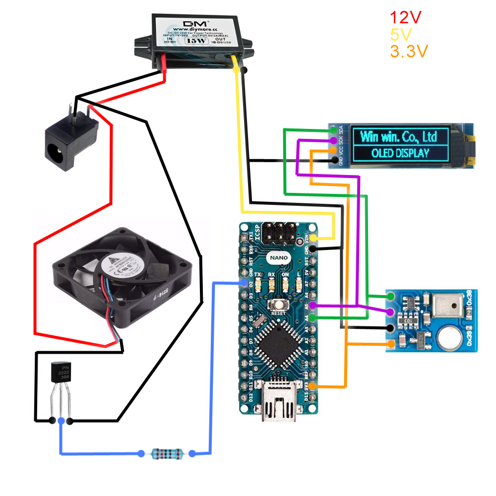

# Liste des composants
- 1x [Transformateur 12V vers 5V](https://www.aliexpress.com/item/1005005912228689.html)
- 1x [Résistance 220 ohm](https://www.aliexpress.com/item/1005002091320103.html)
- 1x [Transistor NPN P2222 (kit)](https://www.aliexpress.com/item/1005006024313024.html)
- 1x [Ecran OLED 0.91" - 128x32 pixels](https://www.aliexpress.com/item/32672327708.html)
- 1x [Arduino Nano](https://www.aliexpress.com/item/4000587268145.html)
- 1x [Adaptateur secteur 230V vers 12V](https://www.aliexpress.com/item/1005004848546464.html)
- 1x [Connecteur pour prise 12V (5.5 x 2.5mm)](https://www.aliexpress.com/item/1005005067294077.html)
- 1x [Ventilateur 12V 60mm](https://www.aliexpress.com/item/32712190499.html)
- 1x [Capteur température/humidité](https://www.aliexpress.com/item/1005001726751347.html)

# Librairies nécessaires
- [Adafruit SSD1306](https://github.com/adafruit/Adafruit_SSD1306)
- [Adafruit AHTX0](https://github.com/adafruit/Adafruit_AHTX0)

# Câblage
